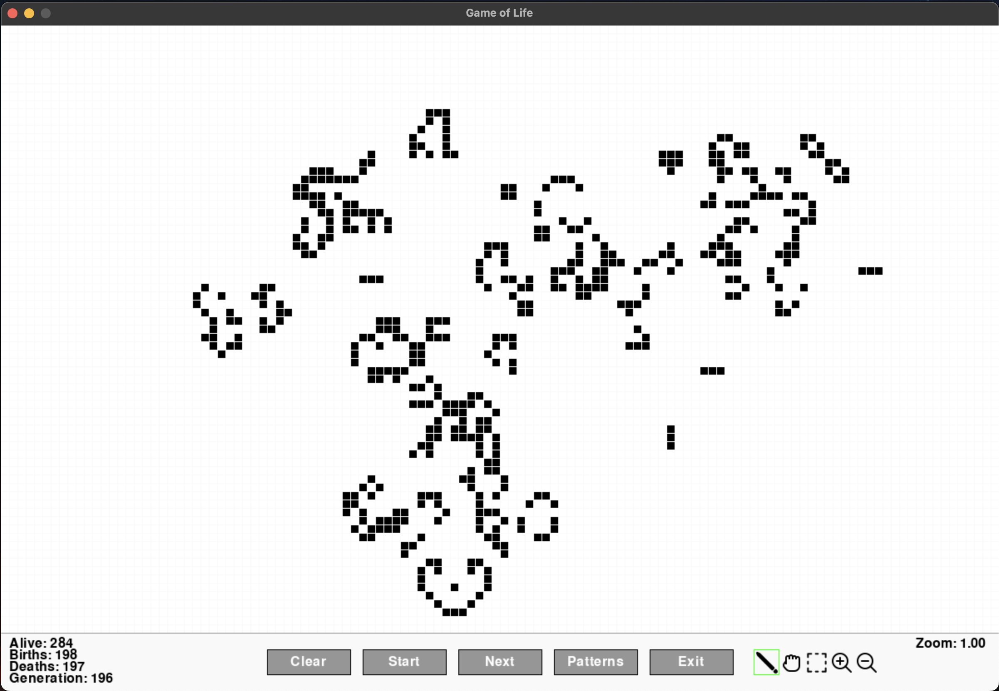

# Game of Life simulator

Yet another Game of Life simulator, developed using the python [pygame library](https://github.com/pygame/pygame). This project was started out of an interest to learn pygame as well as conway's game of life. It's a WIP and has limited functionality. The open source software Golly is the recommended software for simulating Conway's Game of Life, as well as the simulator on the official website.

## Install Dependencies

`pip3 install -r requirements.txt`

## Run the game

`python3 game.py`

## Features

## Contributing

1. Fork it
2. Create feature branch (`git checkout -b feature/adding-xyz`)
3. Make some changes and commit (`git commit -m '...'`)
4. Push changes to remote feature branch (`git push origin feature/adding-x-and-y`)
5. Create PR when feature branch is ready for review

## TODO

- Input mode tooltips (on hover)
- Pattern tooltips (on hover)
- Cell selection & controls (copy, cut, save)
- Zooming in/out on universe (decrease/increase cell size) on mouse scroll
- Panning to view other parts of the universe
- Rotate selected pattern by 90 degrees on hot key
- Support [RLE](https://conwaylife.com/wiki/Run_Length_Encoded) format
- Implement hashlife algorithm and algorithm selector
